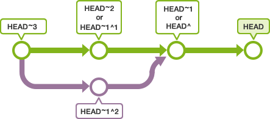
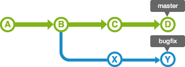

# Git
버전 관리 도구

Git으로 파일을 관리하면, 업데이트 이력이 Git에 저장된다.\
매번 백업용 파일 복사본을 만들 필요가 없으므로 편하고 깔끔하다.

### repository (저장소)
- 원격 저장소 (Remote Repository)
- 로컬 저장소 (Local Repository)
  - 저장소를 새로 만들기
  - 이미 만들어져 있는 원격 저장소를 복사해오기

### commit
파일 및 폴더의 추가/변경 사항을 저장소에 기록하는 버튼.\
커밋 버튼을 누르면 이전 커밋 상태부터 현재 상태까지의 변경 이력이 기록된 커밋(혹은 리비전)이 만들어진다.\
커밋은 시간 순으로 저장된다.\
그래서 최근 커밋부터 거슬러 올라가면 과거 변경 이력과 내용을 알 수 있다.

- 기능을 구현하기 전에 java-baseball/README.md 파일에 구현할 기능 목록을 정리해 추가한다.
- Git의 커밋 단위는 앞 단계에서 README.md 파일에 정리한 기능 목록 단위로 추가한다.
- [AngularJS Git Commit Message Conventions](https://gist.github.com/stephenparish/9941e89d80e2bc58a153) 참고
    
### Work tree / Index
폴더 = 작업 트리(Work Tree)\
커밋을 실행하기 전 저장소와 작업 트리 사이에 존재하는 공간 = 인덱스

즉, 커밋을 하면 작업 트리(로컬 저장소)의 변경 내용이 원격 저장소가 아닌 그 사이 인덱스에 기록(stage)된다.

### push (밀어넣기)
원격 저장소에 로컬 저장소의 변경 이력을 공유, 업로드하기

### clone (복제하기)
원격 저장소의 내용을 복제해서 로컬 저장소에 다운로드하기\
변경 이력도 함께 복제되어 오므로 원래 원격 저장소와 똑같이 이력을 참고하고 커밋을 진행할 수 있다.

### pull (가져와 병합하기)
다른 사람이 원격 저장소에 push 한 내용을 로컬 저장소에 가져와 병합하기\
최신 변경 이력도 함께 다운로드한다.

### merge (변경 이력 병합하기)
내가 pull 을 실행해서 로컬 저장소에서 편집하고 있는 도중\
다른 사람이 먼저 push 를 해서 원격 저장소가 업데이트 되어버린 경우\
내 push 요청이 거부된다.

이 때 merge 하여 다른 사람의 업데이트 이력을 내 저장소에도 갱신해야 한다.\
만약 merge 하지 않고 push 한다면 다른 사람이 push 한 내역이 사라진다.

보통은 Git 에서 변경한 부분을 자동으로 merge 해주는데\
원격 저장소와 로컬 저장소에서 변경된 부분이 동일할 경우 어느 변경사항을 저장할지 판단할 수 없으므로 수동으로 merge 해야한다.

## branch
독립적으로 작업을 진행하기 위해 만든다.\
각각의 브랜치는 다른 브랜치의 영향을 받지 않기 때문에 여러 작업을 동시에 진행할 수 있다.\
이렇게 만들어진 브랜치는 다른 브랜치와 merge 함으로써 작업한 내용을 하나의 브랜치로 모을 수 있다.

- master branch

  저장소를 처음 만들면 master 라는 branch 가 만들어진다.\
  새로운 브랜치를 만들어서 사용하겠다고 선언 (checkout) 하지 않으면 모든 작업 (add, commit 등) 은 master 브랜치에서 이루어진다.

- 통합 브랜치(Integration Branch) 
- 토픽 브랜치(Topic Branch)

 

### checkout
Git 에서는 항상 작업할 브랜치를 미리 선택해야 한다.\
처음에는 master 브랜치가 선택되어 있다.\
브랜치를 변경하고 싶다면 checkout 명령어를 사용하여 브랜치를 전환하면 된다.\
checkout 을 실행하면 원래 브랜치에 있던 마지막 커밋 내용이 작업 트리에 펼쳐지고\
이후의 커밋 내용은 전환된 브랜치에 추가된다.

### HEAD
HEAD 사용하고 있는 브랜치의 선두 부분을 뜻한다.\
HEAD 를 이동하면 사용하는 브랜치가 변경된다.

> 커밋을 지정할 때 '~' 와 '^' 을 이용하여 현재 커밋으로부터 특정 커밋의 위치를 가리킬 수 있다.
> 
> 현재 커밋(HEAD) 를 기준으로
> - '~' + 몇 세대 앞에 있는지
> - '^' + 몇 번째 원본인지
> 
>  

### stash
변경 내용을 일시적으로 기록해두는 영역

변경 내용을 커밋하지 않고 다른 브랜치로 전환 (checkout) 하면 \
그 변경 내용은 전환된 브랜치에서 커밋할 수 있다.

단 변경 내용이 전환된 브랜치에서도 변경되어있던 부분이라면 \
(merge 를 실행했을 때 서로 충돌이 일어나는 경우처럼) 어떤 변경 내용을 저장할 지 판단할 수 없으므로 checkout 에 실패할 수 있다.\
따라서 stash 에 커밋하지 않은 변경 내용을 일시적으로 저장해둘 수 있다.\
stash 에 저장된 변경 내용은 원래의 브랜치나 다른 브랜치에 불러와 커밋할 수 있다.

## merge
- fast-forward(빨리 감기) 병합

- non fast-forward

'non fast-forward 병합'을 실행하면, 브랜치가 그대로 남기 때문에 그 브랜치로 실행한 작업 확인 및 브랜치 관리 면에서 더 유용할 수 있다.

- merge commit(병합 커밋)

### rebase

- 'non fast-forward 병합' 방식으로 브랜치 통합하기
  - 'bugfix' 브랜치의 이력이 'master' 브랜치 뒤로 이동
  - 이동하는 커밋 X 와 Y 내에 포함되는 내용이 'master'의 커밋된 버전들과 충돌하는 경우 각각의 커밋에서 발생한 충돌 내용을 수정
  - 'master'의 위치는 그대로 유지
  

  
  - fast-foward(빨리감기) 병합 하면 'master' 브랜치의 위치가 변경된다.
 

  

  

> merge 와 rebase 는 통합 브랜치에 토픽 브랜치를 통합하고자 하는 목적은 같으나, 그 특징은 약간 다르다.
> - merge
>   변경 내용의 이력이 모두 그대로 남아 있기 때문에 이력이 복잡하다.
> - rebase
>   이력은 단순하지만 원래의 커밋 이력이 변경된다.\
>   정확한 이력을 남겨야할 경우 사용하면 안된다.

## 원격 저장소

### pull
- origin/master : 원격 저장소 origin 의 master 브랜치
- master : 로컬 저장소의 master 브랜치

- 원격 저장소에 로컬 저장소의 변경 내용이 모두 반영된 상태에서 원격 저장소의 추가 변경 사항을 로컬 저장소로 가져오는 경우
  
  
- 원격 저장소에 로컬 저장소의 변경 내용이 모두 반영되지 않은 상태에서 원격 저장소의 추가 변경 사항을 로컬 저장소로 가져오는 경우
  
  - 양 쪽의 변경을 통합 후 원격 저장소의 내용을 가져온다.
    - 충돌이 일어나지 않는 경우 자동으로 merge commit 이 만들어지지만
    - 충돌이 일어나는 경우 수동으로 해결한 다음 직접 commit 해줘야 한다.
      

### fetch
- pull : 원격 저장소의 내용을 가져와 자동으로 병합
- fetch : 원격 저장소의 내용을 가져와 병합하지 않고 내용만 확인

fetch 를 실행하면 원격 저장소의 최신 커밋 이력을 이름 없는 브랜치로 로컬에 가져온다.\
(이 이름없는 브랜치는 'FETCH_HEAD'의 이름으로 checkout 할 수도 있다.)

> 1. 로컬 저장소 (의 mater 브랜치) 와 원격 저장소 origin (의 master 브랜치) 모두 B 까지 commit 한 상태
> 2. fetch 실행
> 3. 원격 저장소의 최신 커밋 이력인 Y 를 이름 없는 브랜치로 가져오는데 'FETCH_HEAD'라는 이름으로 checkout 한다.
> 
> 

> 원격 저장소의 내용을 로컬 저장소에 통합하고 싶다면\
> 'FETCH_HEAD' 브랜치를 merge 하거나 pull 을 실행한다.
> - pull = fetch + merge
> 
> 

### push
로컬 저장소의 데이터를 원격 저장소로 push(밀어넣기) 할 때에는\
push 한 브랜치가 'fast-forward 병합' 방식으로 처리되도록 해야한다.

push 하지 않고 로컬 저장소에서 마음껏 변경할 수 있다. 하지만 공유하기 위해서는 push 해야한다.

push 된 commit 은 임의로 변경할 경우 다른 저장소에 영향을 줄 수 있으므로 유의해야 한다.

### tag
커밋을 참조하기 쉽도록 알기 쉬운 이름을 붙이는 것\
(한 번 붙인 태그는 브랜치처럼 위치가 이동하지 않고 고정된다.)

- 일반 태그(Lightweight tag)
  - 이름만 붙일 수 있다.
- 주석 태그(Annotated tag)
  - 이름을 붙일 수 있다.
  - 태그에 대한 설명도 포함할 수 있다.
  - 서명도 넣을 수 있다.
  - 태그를 만든 사람의 이름, 이메일, 태그를 만든 날짜 정보도 포함할 수 있다.
  
보통 릴리스 브랜치(Release branch) 에서는 주석 태그를 사용\
로컬에서 일시적으로 사용하는 토픽 브랜치(Topic branch) 에서는 일반 태그 사용

태그 이름을 지정하여 checkout 하거나 reset 함으로써 \
간단하게 과거의 특정 상태로 되돌릴 수 있다.

## 참고자료
- [누구나 쉽게 이해할 수 있는 GIT 입문](https://backlog.com/git-tutorial/kr/)
