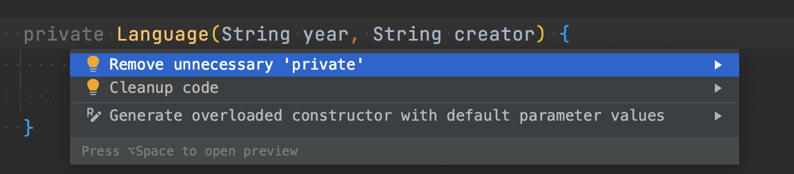

### main
[참고자료1](https://javacpro.tistory.com/11) [참고자료2](http://tcpschool.com/java/java_intro_program)

```java
System.out.print("경주할 자동차 이름을 입력하세요(이름은 쉼표(,)를 기준으로 구분).");
System.out.println("경주할 자동차 이름을 입력하세요(이름은 쉼표(,)를 기준으로 구분).");
```

기능 구현, 코드 작성

클래스, 메서드, 변수의 이름을 지을 때 어떠한 규칙에 맞게끔 짓도록 약속한 것\
컨벤션\
[Google Java Style Guide](https://google.github.io/styleguide/javaguide.html) 에 맞게 네이밍하기\
메서드명은 보통 동사로 시작한다.\
변수의 이름을 지을 때에는 변수의 타입과 해당 변수가 표현하고자 하는 대상에 대해서 고민해보고 그 의미를 잘 나타낼 수 있도록 짓는다.\
파라미터명도 의미있게 만들기

띄어쓰기.\
if, for 문의 body 에 중괄호 생략하지 않기.
줄바꿈 신경쓰기\
사용하지 않는 코드는 주석처리로 남겨두기보다 과감히 삭제하기.

### static
Scanner 객체를 input과 output 메서드에서 계속해서 생성하고 있어요. 반복되는 객체의 생성을 하기보단, static 필드로 선언한 뒤 초기화하여 사용

### final static (constant)
cars.length 가 반복문 루프를 돌때마다 호출되고 있어요. 의미를 드러낼 수 있는 변수로 만들어서 추출

###
기능 별로 메서드로 분리\
IntelliJ 의 도움을 받아서 메서드 추출을 해보시고, 감을 익히기\
[참고자료](https://gmlwjd9405.github.io/2019/05/21/intellij-shortkey.html) 의 리팩토링 부분

### 클래스의 인스턴스 변수, 인스턴스 메서드

### 포장

### enum
Enum의 경우, 위와 같이 접근제한자를 생략하여도 생성자의 접근 제한자가 private로 지정되게 됩니다\
intelliJ 활용\

[참고자료](https://www.nextree.co.kr/p11686/) 참고


- [Java에서 배열에 새 요소를 추가하는 방법](https://www.delftstack.com/ko/howto/java/how-to-add-new-elements-to-an-array-in-java/)